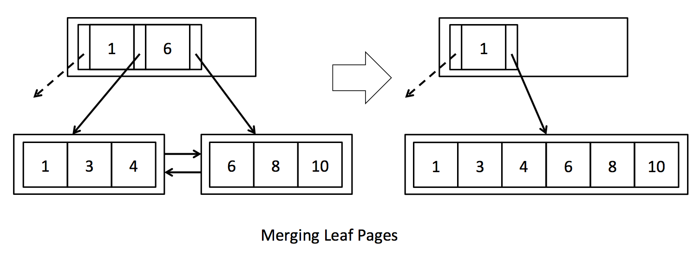
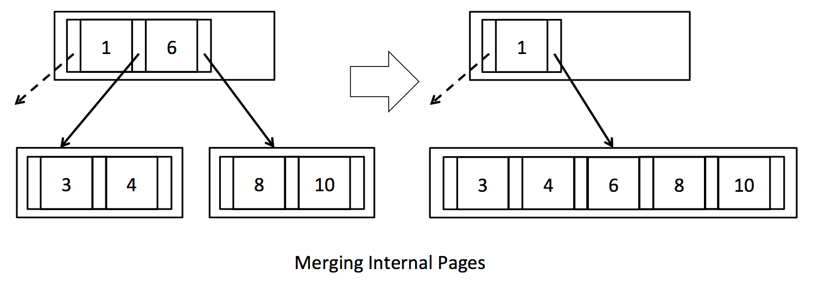

# 开发过程笔记

各 lab 大致任务如下：

1. Lab1 文件读写
2. Lab2 增删改查
3. Lab3 查询优化
4. Lab4 事务管理
5. Lab5 索引优化

## Lab1

综述：实现读取分页二进制文件转换为数据表，数据表含多个页面，每个页面含多行(tuple)，并实现对数据表的顺序遍历。

### Exercise1

#### 任务要求

阅读文档 `lab1.md` 可知，需要完成 `storage` 包的 `Tuple.java` 和 `TupleDesc.java` 两个类的补充编写，通过 `TupleTest` 和 `TupleDescTest`。

阅读源码，根据相关知识推断，`TupleDesc` 是一张数据表的各列的声明(description)，其中，要手写的数据库支持两种数据类型(参见 `common.Type` 枚举类)，其中 `INT_TYPE` 长度为 $4$ 位，定长字符串类 `STRING_TYPE` 长为 $128+4$ 位，恒只有 $128$ 个字符。这两种数据类型的父类是 `common.Field`，子类是 `IntField` 和 `StringField`。基本的方法已经写好，包括比较、构造、取值等。且 `TupleDesc` 有一个静态内部类 `TDItem`，有 `Type fieldType` 和 `String fieldName` 两个属性。

`TupleDesc` 未实现的方法有：

- 构造函数 `public TupleDesc(Type[] typeAr, String[] fieldAr)`

  `public TupleDesc(Type[] typeAr)`

- 取字段数 `public int numFields()`

- 取各字段迭代器 ` public Iterator<TDItem> iterator()`

- 取特定字段 `public String getFieldName(int i) throws NoSuchElementException`

  `public Type getFieldType(int i) throws NoSuchElementException`

- 取字段下标 `public int indexForFieldName(String name) throws NoSuchElementException`。注意传 null 要 throw。如果字段未命名要 throw。

- 取大小 `public int getSize()` (bytes) 即各字段的大小之和

- 合并字段 `public static TupleDesc merge(TupleDesc td1, TupleDesc td2)`，直接有序拼接

- 判断相等 `public boolean equals(Object o)`

- 与 null / object 不等；自己与自己相等，字段同样相等

- 输出 `public String toString()`

阅读 `TupleDescTest` 单元测试类，核实需要做的功能：

- `public void getType()` 检查每个字段是否正确，支持 1000 个字段，下同
- `public void nameToId()` 检查每个字段命名是否正确
- `public void getSize()` 
- `ublic void numFields()`
- `public void testEquals()`
- `public void combine()`

`RecordId` 是一个未实现类。暂时按下不表。`Tuple` 是对应数据库的一行，维护表头描述和具体值。

`Tuple` 未实现的方法有：

- 构造函数 `public Tuple(TupleDesc td)`

- 取字段描述 `public TupleDesc getTupleDesc()`

- 取该表在磁盘的记录号 `public RecordId getRecordId()`

- 设置特定字段 `public void setField(int i, Field f)`

  `public Field getField(int i)`

- `public String toString() `

- 取所有值 `public Iterator<Field> fields()`

- 重新设置 `public void resetTupleDesc(TupleDesc td)`

`TupleTest` 单元测试要完成的功能：

- `public void modifyFields()`
- `public void getTupleDesc()`
- `public void modifyRecordId()` (暂时不管)

#### 具体实现

##### TupleDesc

考虑到 `TupleDesc` 的少修改性质，使用直接的 `ArrayList` 或静态数组能达成 $O(1)$ 的询问，所以直接用其小模拟上述的 CRUD 即可。考虑到方便性，且 `ArrayList` 与静态数组的性能常数差别不大，这里考虑使用 `ArrayList`。

考虑到可能频繁的查询需求，这里对判断相等、根据列名取下标进行了预处理(使用了哈希表)，以多一倍的空间代价换取了高效的时间代价。具体而言，除了构造函数、合并(`combine`)和输出(`toString`)外，所有其他 `TupleDesc` 的函数实现，即：`numFields, iterator, getFiledName, getFieldType, indexForFieldName, getSize, equals` 函数都完成了 $O(1)$ 的实现。

使用的内部成员变量为：

```java
private ArrayList<TDItem> items;
private int size; // 预处理
private int hashCode; // 预处理
private HashMap<String, Integer> name2index; // 预处理
```

特别地，为 `TDItem` 类新增了 `hashCode` 方法，以支持 $O(1)$ 的 equals 实现。具体哈希函数为：

```java
@Override
public int hashCode() {
    if (fieldName == null) {
        return 0;
    }
    return fieldName.hashCode() * (fieldType == Type.INT_TYPE ? 7 : 11);
}
```

其中 7 和 11 是两个质数，能比较好地减少冲突。如果后续还需要反复对 `Type` 类求冲突，则将考虑会把 `hashCode` 函数写到 `Type` 去。

综上所述，`TableDesc` 本质上还是一个简单朴素的 CRUD 小模拟，很好实现。详见源码。

##### Tuple

不考虑 `RecordId`，那么剩下的事情就是同理，加成员属性：

```c++
private TupleDesc tupleDesc;
private ArrayList<Field> fields;
```

实现对其的初始化和查询修改即可。

> 对于代码注释给定的 `only affecting the TupleDesc`，我个人的理解是只需要修改 `tupleDesc` 而不用管 `fields`，我暂时没看到 `resetTupleDesc` 在单元测试出现，所以不知道它具体会用来干嘛，如果以后这里出错了，再修改一下，改成把 `fields` 也重新刷新一遍即可。


### Exercise2

#### 任务要求

`common.Database` 是一个饿汉单例模式，拥有一个 `common.Catalog _catalog` 和其他内容(后续再说)。`DbFile` 是一个接口，表示一个磁盘的数据库文件。

> 具体而言，`DbFile` 接口提供的方法如下：
>
> - `TupleDesc getTupleDesc()`
>
> - `int getId()` 唯一标识 `HeapFile` 的 ID
>
> - `DbFileIterator iterator(TransactionId tid)` 
>
>   其中 `DbFileIterator` 是遍历所有 `Tuple` 的迭代器，有 `open(), hasNext(), next(), rewind(), close()` 方法
>
>   `TransactionId` 标识事务 ID，其 ID 通过静态类原子计数器自增，即每次构造函数得到唯一自增的整数 long 作为事务 ID，通过 `public long getId()` 取出
>
> - `Page readPage(PageId id)` 读取磁盘的一页
>
>   其中 `PageId` 是接口，有 `int getTableId()`, `int getPageNumber()` 等方法
>
>   `Page` 是接口，有 `PageId getId()`, `byte[] getPageData()` 等方法
>
> - `void writePage(Page p)`
>
> - `List<Page> insertTuple(TransactionId tid, Tuple t)`
>
> - `List<Page> deleteTuple(TransactionId tid, Tuple t)`

`Catalog` 支持的方法：

- 构造函数 `public Catalog()`

- 添加数据表 `public void addTable(DbFile file, String name, String pkeyField)` (第三个参数是主键名字)

  `public void addTable(DbFile file, String name)`

  `public void addTable(DbFile file)`

  name 不能 null，可以空串；冲突时覆盖被冲突者

- 取数据表 `public int getTableId(String name) throws NoSuchElementException`，其中 table id 是随机的(不是 auto increment)，注意判 null。重复 table name 但不同 table id 可以允许

  `public TupleDesc getTupleDesc(int tableid) throws NoSuchElementException`

  `public DbFile getDatabaseFile(int tableid) throws NoSuchElementException`

  `public String getPrimaryKey(int tableid)`

- 取数据表id遍历器 `public Iterator<Integer> tableIdIterator()`

- 清空 `public void clear()`

单元测试 `CatalogTest` 要完成的任务：

- 新建两表格 `@Before public void addTables()` 
- `public void getTupleDesc()` 
- `public void getTableId()`
- `public void getDatabaseFile()`
- `public void handleDuplicateNames()` 重复 table name 但不同 table id 可以允许，新 id 覆盖旧 id。
- `public void handleDuplicateIds()` 重复 table id 不同 table name 可以允许，新 name 覆盖旧 name

#### 具体实现

考虑用 name 或 id 作键，`DBFile` 做值的 `HashSet`，能够满足功能需求，也符合实际含义。且 `DBFile` 能导出要求的 `TupleDesc`。考虑迭代器需求，用 id 作键，像 `TDItem` 一样做一个 name, 主键和 `DBFile` 三元组，且反向再用 name 做键对 id。对冲突讨论：

1. 新增重复 name 不同 id，会修改反向 `HashSet`，但通过 id 仍能找到旧表，所以要手动删掉旧表
2. 新增重复 id 不同 name，直接修改 `HashSet`，但反向能找到旧的无效 id，所以要手动删掉旧表
3. 新增重复 name 重复 id，两边都删。

总结逻辑为：先删重复 id 和重复 name，之后再插入。

新增的内部类为：

```java
public static class TableItem implements Serializable {
    public final DbFile dbFile;
    public final String name;
    public final String primaryKey;
}
```

新增的成员变量为：

```java
private HashMap<Integer, TableItem> tables;
private HashMap<String, Integer> name2tableId;
```

同理，空间换时间，增加一点(不是一倍，`TupleDesc` 同理，两个 map 显然空间不一样)的空间，换取更优的时间效率，但是维护修改的代价也有所增大。所有方法(除构造函数和 clear 外)理论上都是 $O(1)$ 实现，即 `addTable, getTableId, tableIdIterator, getTupleDesc, getDatabaseFile, getPrimaryKey`。


### Exercise3

#### 任务要求

`Database` 单例有 `storage.BufferPool _bufferpool`，用于缓存从外存读到内存的页面。在这次练习需要完成构造函数和 `getPage()` 方法。最多存储 `numPages` 页，如果超了就用置换算法换掉(后续任务实现)。`flush_all_pages()` 是一个测试用方法，不能在正式代码使用。在日后的 `HeapFile` 测试才会测试该 `Exercise` 的内容。

`BufferPool` 仍要实现的方法：

- `public BufferPool(int numPages)` 创建给定页面数上限的缓存池

- `public Page getPage(TransactionId tid, PageId pid, Permissions perm) throws TransactionAbortedException, DbException`

  读取特定页面，具体逻辑：如果已经存在直接返回，否则如果空间未满，加入并返回，否则，置换加入并返回。

  其中 `Permissions` 是枚举类，有 `READ_ONLY`，`READ_WRITE` 两种权限。

> 其他在后续练习中才需要做的方法：
>
> - `public void unsafeReleasePage(TransactionId tid, PageId pid)`
> - `public void transactionComplete(TransactionId tid)`
> - `public boolean holdsLock(TransactionId tid, PageId p)`
> - `public void transactionComplete(TransactionId tid, boolean commit)`
> - `public void insertTuple(TransactionId tid, int tableId, Tuple t) throws DbException, IOException, TransactionAbortedException `
> - `public void deleteTuple(TransactionId tid, Tuple t) throws DbException, IOException, TransactionAbortedException `
> - `public synchronized void flushAllPages() throws IOException`
> - `public synchronized void removePage(PageId pid)`
> - `private synchronized void flushPage(PageId pid) throws IOException`
> - `public synchronized void flushPages(TransactionId tid) throws IOException`
> - `private synchronized void evictPage() throws DbException`

#### 具体实现

因为没有考虑未实现的功能，如锁、权限、事务，只考虑对最基本有限页面的管理和置换，所以后期可能需要重构该类。

由于我本人做 `Exercise 3` 时是暂时跳过的，先做了 `Exercise 4` 再倒回来做的，所以这里从下一个 `Exercise` 可以知道，`Page` 接口(下面具体为 `HeapPage` 类)的实现类存储了一个页面的全部信息，构造一个 `Page` 实现类需要传入 `byte[] data`，即首先需要读取文件，要知道文件的路径。

根据上文可知，`Catalog` 类实现了 table id 取 `DbFile`，其中 `DbFile` 含有磁盘文件路径 `File` 对象。所以实现了读取 Page。

由于只有最大 50 个页面，阅读 `Database` 类可知，不再会修改页面数，所以置换算法的时间复杂度要求不高。考虑使用 LRU 置换算法，鉴于只有 50 个页面，直接开一个维护各页面最大访问时间的 map 即可，然后每次暴力枚举所有页面的访问时间，把最小的页面扬了。

具体而言，开一个 `static final AtomicLong` 维护当前抽象时间，每次访问一个页面时间+1。然后维护支持并发的 map (`ConcurrentHashMap`)，记录每个页面 ID 的访问时间。同理，用并发 map 维护页面 ID 与页面的映射。

注意到可能并发访问，缺页时需要同步 synchronized 一下，避免反复读缺少的页。

增设内部辅助类：(可能后续会改)

```java
public static class LRUStrategy {
    static final AtomicLong nowcnt = new AtomicLong(0);
    public long getNow() {
        return nowcnt.getAndIncrement();
    }
    final ConcurrentHashMap<PageId, Long> lastCnt = new ConcurrentHashMap<>();
    public void visitPage(PageId pageId) {
        lastCnt.put(pageId, getNow());
    }
    public PageId getLruPageId() {
        PageId minPage = null;
        Long minCnt = Long.MAX_VALUE;
        for (Map.Entry<PageId, Long> pair : lastCnt.entrySet()) {
            Long cnt = pair.getValue();
            if (cnt < minCnt) {
                minCnt = cnt;
                minPage = pair.getKey();
            }
        }
        assert minPage != null;
        return minPage;
    }
    public void removePage(PageId pageId) {
        lastCnt.remove(pageId);
    }
}
```

增设成员：

```java
private final int numPages;
private final ConcurrentHashMap<PageId, Page> pages;
private final LRUStrategy lru;
```

则核心逻辑为：(可能后续会改)

```java
public Page getPage(TransactionId tid, PageId pid, Permissions perm)
    throws TransactionAbortedException, DbException {
    // DONE: some code goes here
    Page page = pages.get(pid);
    if (page == null) {
        synchronized (this) {
            DbFile file = Database.getCatalog().getDatabaseFile(pid.getTableId());
            page = file.readPage(pid);
            while (pages.size() >= numPages) {
                evictPage();
            }
            pages.put(pid, page);
            lru.visitPage(pid);
        }
    }
    return page;
}
```


### Exercise4

#### 任务要求

从磁盘读写数据的文件包括 heap files(tuples 的无序组合)和 B 树。

一个 `storage.HeapFile` 包含一些页面，每个页面有固定数量的字节(`BufferPool.DEFAULT_PAGE_SIZE=4096`bytes，含头部)。一个 slot 槽可以容纳一个 tuple 元组。头部包含 bitmap，每一位表示一个槽，若位值为 1，则该 tuple 有效，为 0 无效(删掉或未初始化)。具体的 `Page` 实现类是 `HeapPage`。这些 page 存在 `BufferPool`，被 `HeapFile` 读写。

每个 tuple 有 1 位头部，大小为 $8|tuple\_size|+1$ 位，故每页能存 $n=\lfloor\dfrac{8|page\_size|}{8|tuple\_size|+1}\rfloor$ 个 tuple。头部占用字节数显然为 $\lceil\dfrac n8\rceil$。LSB(least significant/low bit)标识 slot 的状态，即第一个 slot 是否有效，以此类推。而 JVM 是大端存储的，即如0x1234数据和两个地址0x1,0x2，0x1存0x12, 0x2存0x34，所以一个数组，按顺序读就行，不用倒序读。无效 slot 就全 0 位占对应的 tuple。整个结构是：头部(01数组)+按顺序各tuple。

`storage.HeapPageId` 是 `PageId` 接口实现类，需要完成：

- `public HeapPageId(int tableId, int pgNo)`
- `public int getTableId()`
- `public int getPageNumber()`
- `public int hashCode()`
- `public boolean equals(Object o)`

有单元测试 `HeapPageIdTest`，很简单，不细说。

`storage.RecordId` 表示特定 table 的特定 page 的一个 tuple。有需要完成的：

- `public RecordId(PageId pid, int tupleno)` (即 slot id)
- `public int getTupleNumber()`
- `public PageId getPageId()`
- `public int hashCode()`
- `public boolean equals(Object o)`

有单元测试 `RecordId`，很简单，不细说。

`storage.HeapPage` 存储一页的数据，并存储在 `BufferPool`，实现了 `Page` 接口。构造函数已经写好框架，具体子函数有需要补充的，功能是将字节流转为具体数据。需要完成：

- `private int getNumTuples()` 通过上述公式计算
- `private int getHeaderSize()` 通过上述公式计算
- `public HeapPageId getId()` 
- `public int getNumUnusedSlots()`
- `public boolean isSlotUsed(int i)`
- `public Iterator<Tuple> iterator()`

> 以后要做的：
>
> - `public void deleteTuple(Tuple t) throws DbException`
> - `public void insertTuple(Tuple t) throws DbException`
> - `public void markDirty(boolean dirty, TransactionId tid)`
> - `public TransactionId isDirty()`
> - `private void markSlotUsed(int i, boolean value)`

需要通过 `HeapPageReadTest` 单元测试，具体为对上述函数的基本测试。

#### 具体实现

`HeapPageId` 感觉是纯纯的 POJO，直接存 `private final int tableId, pgNo` 即可。哈希值使用了质数 $100007tableId+pgNo$。`equals` 仿照 `transaction.TransactionId` 依葫芦画瓢。

同理，`RecordId` 也是 POJO，直接存即可，哈希这里用了 $100003hash(pid)+tupleNo$。其他画瓢即可。

对 `HeapPage`，根据上文公式(整数上下取整即可，不需要用 Math 类)求出要求的页数等。注意到 header 本身就是 slot 的压位存储，byte 是 0-255 的整数。所以求 0 的个数即可统计未用 slots 数。那么就很简单了。对 slot 号对应 header 位，即第 $\lfloor\dfrac {slot}8\rfloor$ 个 byte 数组元素的第 $slot\bmod 8$ 低位。

注意到 iterator 注释里要求需要跳过空的 slots，所以遍历一下去重，重构一下 tuples 为 `ArrayList` 即可。


### Exercise5

#### 任务要求

从磁盘读取一页，需要计算文件偏移量，读取时不能调用 `BufferPool`。

`storage.HeapFile` 的 iterator 方法遍历所有元组，必须使用 `BufferPool.getPage`。打开文件时不能把整个数据表载入内存。

`HeapFile` 实现了 `DBFile` 接口，应包含一系列 `Page`。要实现：

- `public HeapFile(File f, TupleDesc td)`
- `public File getFile()`
- `public int getId()` 需要管理生成唯一的 table id 并返回，可以通过对文件绝对路径做哈希生成
- `public TupleDesc getTupleDesc()`
- `public Page readPage(PageId pid)` 从磁盘读取一页
- `public int numPages()`
- `public DbFileIterator iterator(TransactionId tid)`

具体而言，`DbFileIterator` 需要支持：

- `void open() throws DbException, TransactionAbortedException`
- `boolean hasNext() throws DbException, TransactionAbortedException`
- `Tuple next() throws DbException, TransactionAbortedException, NoSuchElementException`
- `void rewind() throws DbException, TransactionAbortedException`
- `void close()`

> 暂时不需要实现的方法：
>
> - `public void writePage(Page page) throws IOException`
> - `public List<Page> insertTuple(TransactionId tid, Tuple t) throws DbException, IOException, TransactionAbortedException`
> - `public List<Page> deleteTuple(TransactionId tid, Tuple t) throws DbException, TransactionAbortedException`

需要通过的单元测试为 `HeapFileReadTest`，除去基本显然的外，部分具体为：

- `public void readPage()` 读取文件的第一页 ID 存储为 `HeapPageId`，然后根据其调用 `readPage`
- `public void testIteratorBasic()` 得到 iterator it 后，在未调用 `it.open()` 时不可以调用 `next()`(预期抛出异常)，且 `hasNext()` 是 false；open 后，要求元组数目正确，各元组不为 null。
- `public void testIteratorClose()` 在 open 且 close 后，应当调用 `next()` 抛出异常


#### 具体实现

对 `File, TupleDesc` 显然要存储，比较简单。对 ID 的处理，根据提示直接使用 `f.getAbsoluteFile().hashCode()` 即可。重点是 `Page` 相关的全部处理。

根据文件格式的定义，文件是二进制文本、每 page 各自拥有含义，可以知道页数为文件的字节数除以页大小(上取整)。

读取 page，使用 `RandomAccessFile` 打开 File，然后用 seek 跳转起止位置，并逐字符读取即可，读完 data 交给 `HeapPage` 去构造。

对迭代器，如果当前 iterator 为空或没下一个元素了，调用 `BufferPool` 读下一个 page 一次读入若干 tuple，如果调用后还是为空或没下一个元素就 `hasNext` 为假。如果不为假就可以 `next()`。然后注意特判没 `open` 算没 `hasNext`。而 `rewind` 就重新构造即可，`open` 就先设内部状态为已打开再调用 rewind，close 就清掉内部状态。

可以使用匿名内部类，然后事务 ID 是给用来调用 `BufferPool` 的读 page 用的，可以存私有也可以不存。核心 `hasNext` 逻辑是：

```java
if (!opened) {
    return false;
}
if (it == null || !it.hasNext()) {
    readPage(); //最后一页就it=null,否则it=HeapPage.iterator且nowPageNo++
    if (it == null || !it.hasNext()) {
        return false;
    }
}
return true;
```


### Exercise6

#### 任务要求

Operator 操作符负责执行数据库查询。有 `execution.SeqScan` 操作符，顺序遍历给定 table 的所有 tuple。该类实现了 `OpIterator` 接口，该接口与 `DbFileIterator` 十分接近，但是多了一个新的方法 `TupleDesc getTupleDesc()`。

对 `SeqScan`，未实现方法有：

- `public SeqScan(TransactionId tid, int tableid, String tableAlias)` 其中 alias 是 catalog 里存的数据库名字或特别指定(如 SQL 的 as)
- `public String getAlias()`
- `public void reset(int tableid, String tableAlias)`
- `public void open()`
- `public TupleDesc getTupleDesc()`
- `public boolean hasNext()`
- `public Tuple next()`
- `public void close()`
- `public void rewind()`

需要通过 `ScanTest` 系统测试，有：

- `public void testSmall()` 随机生成 8096 行内，4列内的数据表，要求不重不漏地扫描所有项
- `public void testRewind()` 读 100 项然后迭代器归零重读
- `public void testCache()` scan 两次同一个 table，对只有一列的 int，一页有 992 个 tuple，具体而言占用 4092 个 byte 且 993 要占用 4097 故只能 992；期望第一次读时读取到全部页数进缓存(具体而言是 buffer pool 的 50 页大小)，第二次遍历全部时 `readPage` 不正常返回(置换算法如 LRU 大概能保证存进去的不跑走)
- `public void testTupleDesc()` 检查数据表名、列名一致。注意如果 `SeqScan` 的前缀为 `prefix`，则 `TableDesc` 的列名应当为 `prefix.列名`，所以要重构 `TupleDesc`

#### 具体实现

具体迭代(`open, next, close, rewind, hasNext`)就直接调用上一个 exercise 写好的迭代器即可。

对 `TupleDesc`，重新构造一个，把所有 field name 加上前缀 `alias.`。整体而言是比较简单的一个任务。

### 应用测试

如果有一个 2 行 3 列的数据表纯文本 `lab1test.txt` 放在项目根目录：(注意加空行)

```
5,8,0
2,3,3

```

对 `common.SimpleDb.java` 类，根据主函数描述，可以在 ecplise 里点 run as 加参数 `convert lab1test.txt 3`(3代表3列)，然后运行结束发现同目录下出现了 `lab1test.dat`。

参照 `lab1.md` 接下来写一个测试类 `test/simpledb.mytest.Test1` (具体见代码)并运行，来测试整个 `Lab1`，读取一整个文件并输出。


## Lab2

### Exercise1

#### 任务要求

`common.OpIterator` 是关系代数的运算操作。需要实现下面两种运算：

`execution.Filter` 是过滤出满足特定条件的全部 tuples。其中需要使用到 `execution.Predicate` 类，即比较谓词，其内部有一个枚举类 `Op`，具有 `==,<,>,<=,>=,like,!=` 七种枚举值。

`Predicate` 需要完成的功能有：

- `public Predicate(int field, Op op, Field operand)` 传入比较右值(int是表示tuple的第几列)
- `public int getField()`
- `public Op getOp()`
- `public Field getOperand()`
- `public boolean filter(Tuple t)` 传入左值
- `public String toString()`

需要通过 `PredicateTest` 单元测试，包含对整数的 5 种比较。

对 `Filter` 类，实现了 `execution.Operator` 接口，需要完成的功能为：

- `public Filter(Predicate p, OpIterator child)`
- `public Predicate getPredicate()`
- `public TupleDesc getTupleDesc()`
- `public void open()`
- `public void close()`
- `public void rewind()`
- `protected Tuple fetchNext() throws NoSuchElementException, TransactionAbortedException, DbException`
- `public OpIterator[] getChildren()`
- `public void setChildren(OpIterator[] children)`

`Operator` 是抽象类，有成员 `Tuple next`, `boolean open`, `int estimatedCardinality`。实现了 `open()`(改 open 为 true)，`close()`(该 false, 且 next 置 null)，有 card 的 getter, setter，实现了 `hasNext()` 主要是判 open 和 next 是否空且尝试获取(`fetchNext()`)后还未空，实现了 `next()` 若 next 空 `fetchNext()`，仍空就 throw，否则返回 next 并设为 next=null。

`Operator` 有几个抽象方法需要实现：

- `protected abstract Tuple fetchNext() throws DbException, TransactionAbortedException`
- `public abstract OpIterator[] getChildren()`
- `public abstract void setChildren(OpIterator[] children)`
- `public abstract TupleDesc getTupleDesc()`

> 作为参考，项目已经实现了 `OrderBy` 操作和 `Project` 操作。
>
> 以 `OrderBy` 为例，open 时对传入的 `OpIterator child`，遍历它的全部 `Tuple` 并存 `ArrayList` 然后排序，得到排序后的迭代器，后续 `fetchNext` 就用它的迭代器即可。而这个操作的 `getChildren` 就返回 `{child}` 即可，set 同理 `child=children[0]`。
>
> 对 `Project`，即取列的子集操作，`fieldList` 表示要取的列数，重构 `TupleDesc`，每次 next 时对 `child` 的 tuple 重构并返回。

对 `FliterTest` 单元测试，没啥特别好说的。

需要完成的另一个操作符是 `Join`，依赖于 `JoinPredicate`，都在 `execution` 包。其中 `JoinPredicate` 类复用 `Predicate` 类的内部类 `Op`。

`JoinPredicate` 类需要完成的方法有：

- `public JoinPredicate(int field1, Predicate.Op op, int field2)` 分别是左值、操作符、右值
- `public int getField1()`
- `public int getField2()`
- `public Predicate.Op getOperator()`
- `public boolean filter(Tuple t1, Tuple t2)` 比较第 field1 个字段和第 field2 个字段

需要通过 `JoinPredicateTest` 单元测试，内容与 `PredicateTest` 类似。

`Join` 实现 `Operator` 接口，需要完成：

- `public Join(JoinPredicate p, OpIterator child1, OpIterator child2)`
- `public JoinPredicate getJoinPredicate()`
- `public String getJoinField1Name()`
- `public String getJoinField2Name()`
- `public TupleDesc getTupleDesc()`
- `public void open()`
- `public void close()`
- `public void rewind()`
- `protected Tuple fetchNext()`
- `public OpIterator[] getChildren()`
- `public void setChildren(OpIterator[] children)`

需要通过 `JoinTest` 单元测试，具体结果预期跟 SQL 的 join where 差不多。

最后通过同名系统测试 `FilterTest` 和 `JoinTest`。

#### 具体实现

对 `Predicate`，按照要求，复用 `Field` 具体实现类的 `compareTo` 即可，具体为抽取 t 的第 field 个 Field 调用它的 `compareTo` 传入 op, operand。

对 `Filter`，模仿 `Project`，可以完成大部分操作如 `open, close, rewind` 和 children 相关的。对 `fetchNext`，就 while 取下一个直到符合谓词才返回即可。

对 `JoinPredicate`，类比 `Predicate` 容易实现。

对 `Join`，即 SQL 的 join 操作，条件是 where + `Joinpredicate`。由于 next 的特性，导致每个 tuple 只能访问一次，所以对每个左表行，必须缓存下所有匹配的右表行，可以用一个 queue 实现。

### Exercise2

#### 任务要求

聚合语句 group by，只需要完成对单一列的聚合操作，使用 `executor.Aggregator` 接口，该接口有常量 `int NO_GROUPING = -1`，有枚举类 `Op`，提供以下几种聚合操作：`MIN, MAX, SUM, AVG, COUNT, SUM_COUNT, SC_VG`，且 `Op` 类提供方法 `getOp(int i)` 等。接口需要实现：

- `void mergeTupleIntoGroup(Tuple tup)`
- `OpIterator iterator()`

有具体实现类 `executor.IntegerAggregator`，需要实现：

- `public IntegerAggregator(int gbfield, Type gbfieldtype, int afield, Op what)` 等待被 group by 操作保留的列号及其类型；进行聚合运算和存放聚合结果的列号及其聚合操作。如果 `gbfield` 是接口常量 `NO_GROUPING`，只返回结果列，否则多返回一个键列(参考 SQL 一般的 group by)
- ` public void mergeTupleIntoGroup(Tuple tup)` 新合并一列，更新聚合结果
- `public OpIterator iterator()` 遍历聚合结果，返回 pair `groupVal, aggregateVal` 或单列 `aggregateVal`，取决于 `gdfield` 是不是  `NO_GROUPING`。随时可以取迭代器，而不是算完才取，每个迭代器相互独立，故不能缓存单一变量

需要通过 `IntegerAggregatorTest` 单元测试，以 `sum` 为例扼要解释一下测试逻辑：元组以第一列为分组依据，第二列求和，对 `(1,2)` 单行数据表本身就是结果，对  `(1,2),(1,4)` 两行数据表，返回一行结果 `(1,6)`；对 `(1,2),(1,4),(1,6)` 三行数据表，返回一行结果 `(1,12)`；对 `(1,2),(1,4),(1,6),(2,2)` 四行数据表，放回两行结果 `(1,12),(2,2)`。

还有具体实现类 `executor.StringAggregator`，同理实现那三个方法。并通过 `StringAggregatorTest` 单元测试。

需要实现 `executor.Aggregate` 类，同理用到了 `Operator` 接口。需要实现方法：

- `public Aggregate(OpIterator child, int afield, int gfield, Aggregator.Op aop)`
- `public int groupField()`
- `public String groupFieldName()`
- `public int aggregateField()`
- `public String aggregateFieldName()`
- `public Aggregator.Op aggregateOp()`
- `public static String nameOfAggregatorOp(Aggregator.Op aop)`
- `public void open()`
- `protected Tuple fetchNext()`
- `public void rewind()`
- `public TupleDesc getTupleDesc()`
- `public void close()`
- `public OpIterator[] getChildren()`
- `public void setChildren(OpIterator[] children)`

通过 `AggregateTest` 单元测试和 `AggregateTest` 系统测试

#### 具体实现

> 不妨复习一下 SQL group by，设有考生、成绩(科目列忽略)数据表：
>
> ```sql
> create table test (id int, score int);
> insert into test values (1, 100), (1,50), (1, 75), (2, 80), (2, 81), (4, 58);
> select id, sum(score), min(score), max(score), count(score), avg(score) from test group by id;
> select id, sum(score), min(score), max(score), count(score), avg(score) from test; -- NO_GROUPING
> ```
>
> 易得，可自行运行得到结果，由于篇幅这里不写出执行结果。第一个查询有三行结果，第二个查询只有一行结果。
>
> 能理解上述询问，则容易实现。

对 `IntegerAggregator`，可见，对上述操作符，对给定的 `int gbfield, Type gbfieldtype, int afield, Op what`，用 `afield` 列做聚合运算，所有 `gbfield` 相同的列分到一组去，同一组的列求聚合函数结果然后返回。如果 `NO_GROUPING`，则所有列同一组。

对各个操作，直接按照含义维护即可：

1. `MIN`。初始为 int 最大数，每传入一个 Tuple 取 `afield` 列对比保存更小者
2. `MAX`。与 MIN 相反，同理。
3. `SUM`。直接求和即可。
4. `AVG`。需要做整数下取整，所以需要维护求和及计数。
5. `COUNT`。直接计数即可。
6. `SUM_COUNT` 同 `COUNT`。
7. `SC_AVG`。同 `AVG`。

考虑一种优雅的实现，方便未来增加更多操作，不妨使用策略模式的思路，开一个抽象内部类维护 `ans` 成员的更新和取结果方法，然后设子类去实现。根据 what 的不同使用不同的子类。使用原型模式思想创建初始模板。

具体而言，做抽象内部类 `Result implements Cloneable`，提供 `protected int ans = 0` 和默认 `int get()`，重载 `public Object clone()`(这里不 throw, catch `super.clone()` 则 return null 即可)，留抽象方法 `public abstract void merge(int val)`。然后给五个子类去实现。且对 `ResultMin` 和 `ResultMax` 子类，构造函数重新赋值 `ans`，覆盖父类的默认赋值。对 `ResultAvg` 子类，加一个成员函数且重载覆盖 `get()`。

构造函数传进的四个值都同名存下来，开一个哈希表 `private HashMap<Field, Result> groups`，用于保留每组的结果。注意 null 可以做键，故 `NO_GROUPING` 也可特判。

开一个常量池 `private Result[] blanks`(可 static final)，按 `Op what` 的枚举顺序 new 七个对象。然后根据 `what.ordinal()` 取枚举下标，利用 `clone` 办法构造新的初始值。如果此哈希表键从未见过，则将复制的常量池对象作 merge 左值 self，然后新 Tuple 跟他合并后返回 put 回去覆盖哈希表项。即可完成 `mergeTupleIntoGroup()` 实现。

对 `iterator()` 实现，将哈希表转 `List<Tuple>`(注意要将 `Result` 构造成 `Tuple`)，然后调用写好的 `storage.TupleIterator` 类转迭代器即可。

> 因为 `gbfield != NO_GROUPING` 的 if else 写反了(写成 ==)导致手动写 main debug 了十多分钟。还有因为 List 忘记 add 错过，但很快发现了。

> 对 `StringAggregator`，使用本机 mysql8 测试如下数据：
>
> ```sql
> create table test (x int, y char(10));
> insert into test values (1, "abc"), (1, "f"), (1, "bbbbb"), (2, "lr580"), (2, "lr581"), (3, "baicha");
> select x, sum(y), min(y), max(y), count(y), avg(y) from test group by x;
> ```
>
> 发现 min, max 按字典序，且 sum, avg 直接返回 0，所以推断只需要实现三种运算。

因为只有 3 种有效运算符，这里直接朴素实现，而不用更利于修改的设计模式来做了。即只设计一个内部具体类 `Result` 即可。剩余逻辑仿照上面可以快速完成。注意字符串比较用 `.compareTo()`，注意 null 不可比较特判一下最开始。

对 `Aggregate`，其他方法 getter, setter 都很好处理。注意 `gfield` 为 `NO_GROUPING` 不能取 field 否则越界挂，需要直接返回 null。然后根据 `afield` 选择对应的 `Aggregator` 即可。注意 `getTupleDesc` 是结果的描述，这个有两种办法，一个是忽视 open, close 强行调用 `aggregator` 的取迭代器，用迭代器的 `TupleDesc`，但是复杂度差而且不优雅。所以这里考虑给接口 `Aggregator` 加一个 `getTupleDesc()` 接口，然后调整一下两个实现类，把取迭代器里获得 `TupleDesc` 的办法下延。

这里 `Aggregate` 必须要预先处理的思路，考虑仿照 `OrderBy` 的实现思路。因为结果必须要全部遍历完才能知道，显然，以 `NO_GROUPPING` 为例更加如此。从取迭代器的实现也可以看出。

> 记一个没通过系统测试的 `testAverageNoGroup()` 的 debug 过程。但是 debug 花了半个多小时大约，因为一开始没有顺着报错栈去找而是只看了报错文字没看地方先肉眼观察花了不少时间。
>
> 最终找到说 type 是空指针，追溯到是 int 取迭代器的取描述有误，原错误代码为：
>
> ```java
> TupleDesc td = new TupleDesc(new Type[] { gbfieldtype, Type.INT_TYPE });
> if (gbfield == NO_GROUPING) {
>     td = new TupleDesc(new Type[] { Type.INT_TYPE });
> }
> ```
>
> 当 `NO_GROUPING` 时，`gbfieldtype` 为 null，导致构造函数跑不通。正确是放到 else 里，不能偷懒省这点大括号：
>
> ```java
> TupleDesc td = null;
> if (gbfield == NO_GROUPING) {
>     td = new TupleDesc(new Type[] { Type.INT_TYPE });
> } else {
>     td = new TupleDesc(new Type[] { gbfieldtype, Type.INT_TYPE });
> }
> ```


### Exercise3

#### 任务要求

实现对 `HeapFile` 的增删 tuple。`Tuple` 有 `RecordID` 属性帮助找页。增删后对应的文件要产生变化。删修改头部。增就找到 empty slot，如无就加页，保证 `RecordID` 更新顺利。

需要实现脏数据。脏页特指进行过修改，这个修改在缓冲池生效了，但是没有写回磁盘的数据。

对 `HeapPage`，要实现：

- `public void deleteTuple(Tuple t) throws DbException`
- `public void insertTuple(Tuple t) throws DbException`
- `public void markDirty(boolean dirty, TransactionId tid)` 若 true，事务 `tid` 将整页弄脏；否则，页面变回干净
- `public TransactionId isDirty()` 若脏页，返回最新弄脏该页的事务 ID，否则返回 null
- `private void markSlotUsed(int i, boolean value)`

需要通过 `HeapPageWriteTest` 单元测试，具体会测试事务直接弄脏和恢复干净页面；该页所有未用 slots 插入，然后页满再插入就报错；删除不存在的页报错；删掉存在的页面，删空报错。推测增删函数时不需要标脏，以单一职责原则。

对 `HeapFile`，要实现：

- `public List<Page> insertTuple(TransactionId tid, Tuple t) throws DbException, IOException, TransactionAbortedException` 返回值是所有被修改的页面

- `public List<Page> deleteTuple(TransactionId tid, Tuple t) throws DbException, TransactionAbortedException`

  `insert, delete` 必须调用 `BufferPool.getPage()` 来访问页面，否则后续的 lab 做事务时会出错

- `public void writePage(Page page) throws IOException`

对 `BufferPool`，要实现：

- ` public void insertTuple(TransactionId tid, int tableId, Tuple t) throws DbException, IOException, TransactionAbortedException`
- ` public void deleteTuple(TransactionId tid, Tuple t) throws DbException, IOException, TransactionAbortedException` 注意到 tuple 自带 record id，所以能找到 table id。

需要通过 `HeapFileWriteTest` 单元测试，具体而言，根据上文可知对两个 int 的数据表，一页可求出最多 504 行，故第一个测试内容为增加 1009 行，检测有 3 页。第二个测试是写 5 页，其中 2 页全是 1 字节，遍历并统计 tuple 数确实是两页。

需要通过 `BufferPoolWriteTest` 单元测试。

#### 具体实现

先给 `Tuple` 补充 `RecordId` 的 getter, setter。具体而言是 `PageId` 和 `tupleNo` 的 POJO。并给 `Tuple` 重载一个 equals，只判断 fields 是否全都一样(`tupleDesc` 允许不同，如名字)。

> 修复一下上一节的 bug：
>
> - `getNumUnusedSlots()` 使用了 `Integer.bitCount` 统计 1 的个数。然而 byte 全 1 时，值是 -1，隐式转 int 导致符号扩展而不是零扩展，所以导致统计出错。需要强转零扩展，使用 `Integer.bitCount(b & 0xff)`

对 `HeapPage`，与其他类关联度不大。直接先实现。脏就直接存事务即可，为 null 表示不脏。而 mark 就直接赋值即可，1 是有效 0 无效，做做位运算即可，与原本不一样的话该位取反。mark 方法可以用来搞后续的增删。

增删不需要具体写文件(所以脏了)，所以增直接改变成员变量即可，找到第一个空位数组赋值标 slot，给增的 tuple 加一个 `recordId`。删就遍历 tuples，看看有就删了，否则报错。

> 修复上一节一个之前 `HeapFile` 取迭代器的 bug：
>
> - 如果一个页面一条有效记录都没有(如删完了)，那么直接判定为文件尾，虽然 `nowPageNo` 还没走到头，但是 `hasNext` 判到当前页 `!it.hasNext()` 了。解决办法是对翻动 `readPage()` 读取下一个页面时，跳过一条记录也没有的空页，直到找到下一个有行的也位置，即增加递归：`if (it != null && !it.hasNext()) readPage();`。用迭代也行，效率更高，这里懒得大幅度修改了。

对 `HeapFile` 的 `writePage`，一种思路是不移除，而是给 `BufferPool` 增加一个方法 `addPage`，更新 Page 让 pid 指向它，即，对现成 `Page`，重新插入到缓冲区覆盖旧的。这里使用了不清除思路，即用脏来快速 cache 的目的。

对插入行，顺序遍历所有页，看看哪个页有空的就写进去，没有的话就开新页，并且记得开脏、将页面刷新到缓冲池(不止是标记访问，还要确实覆盖)，只有一个页面会被改变。返回值的含义是这些页被更新了，所以需要重新刷入缓冲池，交由缓冲池自己去维护刷新过程，即脏标记和更新哈希表。下同。

对删除行，同理顺序遍历每页，如果这页有要删除的就删了，都没有就报错。

脏页在被置换出缓冲池时，需要将这一页的内容写回磁盘，这就是脏页的最终处理。


### Exercise4

#### 任务要求

实现 `execution` 包的 `Insert` 和 `Delete` 操作符，返回所有被影响的行。调用缓冲池的接口来实现对应的功能。

对 `Insert` 类，实现了 `Operator` 接口，有方法如下：

- `public Insert(TransactionId t, OpIterator child, int tableId) throws DbException`
- `public TupleDesc getTupleDesc()` 一列整数
- `public void open()`
- `public void close()`
- `public void rewind()`
- `protected Tuple fetchNext()`
- `public OpIterator[] getChildren()`
- `public void setChildren(OpIterator[] children)`

需要在 table id 表格里插入给定的 child 的所有行，每次插入后返回一个一列的元组，含一个整数，表示成功插入的元素的个数。通过 `InsertTest` 单元测试和 `InsertTest` 系统测试。

对 `Delete` 类，要实现的内容同理，接口一致。通过 `DeleteTest` 系统测试。

#### 具体实现

这个的实现比较简单，直接套上面 exercise 结果即可。open 时直接插完/删完，缓存结果，然后 fetch 时第一次返回结果即可。

### Exercise5

#### 任务要求

继续完成 `BufferPool`，实现测试用的 `flushPage(), flushAllPages()` 且不能用置换，弹出所有页面，脏的写回去。其中 `flushPage()` 的含义就是脏写回。

需要通过 `EvictionTest` 系统测试。

#### 具体实现

因为我在上一节实现了 LRU 算法，所以这节几乎没啥需要做的，只需要把 `removePage` 改成指向 `flushPage`，然后 `flushAllPages` 不断 `evict` 即可。

实际运行系统测试用时 9.5s。


### 应用测试

到此为止，已经可以实现读取两个文件并联表查询了，具体的 SQL 语句和对应的 java 测试代码见 `lab2.md`。

可以尝试构建两张表格，如 `test/simpledb/mytest` 下，把上面 lab1 的表拖到这个目录，再新建一个 `lab2test` 表，内容类似。用上一个 lab 类似流程，在该目录下建一个新的 `.dat`，然后写了一个自定义测试类 `Test2` 并写了一个测试方法 `jointest()`，测试了类似如下的语句，表现成功：

```sql
SELECT *
FROM some_data_file1, some_data_file2
WHERE some_data_file1.field1 = some_data_file2.field1;
```


编译代码文件，使用 eclipse ant 或其他，用给定的 `build.xml` 跑编译，这里改成了 java 8 适应本机，调整了 GBK 为 UTF8。得到 `dist/simpledb.jar`


现在尝试使用更多接口的功能。如：规定每列的数据结构再进行转换，执行参数：

```
convert test/simpledb/mytest/lab2test.txt 3 "int,int,int"
```

同文件夹下，创建一个表名约束 `lab2testTableName.txt`：

```plain
lab2test (f1 int, f2 int, f3 int)
```

把这两个文件丢到根目录，然后根目录下 cmd 执行：

```sh
java -jar dist/simpledb.jar parser lab2testTableName.txt
```

之后进入交互式，执行：

```sql
select d.f1, d.f2 from lab2test d;
```

执行成功，通过测试。

> 这里出了一个报错但不影响结果，`java.lang.reflect.InvocationTargetException`，所以暂时不管了。


## Lab3

### Exercise1

#### 任务要求

要求实现查询优化，具体优化方法不限，如可以用 Selinger cost-based optimizer。在 `lab3.md` 给了图解如下：


双横线边框的内容是需要实现的。其中，`simpledb.Parser` 类写好了对 SQL 语句的解析，用 `statsMap` 存储了表格统计结果，有查询请求时调用 `parseQueryLogicalPlan`，返回 `optimizer.LogicalPlan`，该返回对象调用 `physicalPlan` 方法能得到 `OpIterator` 用于实际执行查询，该方法需要调用 `optimizer.JoinOptimizer` 类的 `orderJoins` 方法，该方法未实现。

只考虑基本表格读取和 join 语句的开销，不考虑 aggregates 等操作。

对查询 `p=t1 join t2 join ... tn`，如果执行 left deep 策略，则花费为：

```
scancost(t1) + scancost(t2) + joincost(t1 join t2) +
scancost(t3) + joincost((t1 join t2) join t3) +
...
```

其中 `scancost` 是 I/O 读盘的花费，`joincost` 是 CPU 做连接运算的耗费。不考虑高速缓存，设常数 `SCALING_FACTOR`，认为有：

```
cost(predicate application) = 1
cost(pageScan) = SCALING_FACTOR x cost(predicate application)
```

且认为 scan 的耗费等于页数乘以常数 `SCALING_FACTOR`。

一个 Join 的耗费为：

```c++
joincost(t1 join t2) = scancost(t1) + ntups(t1) x scancost(t2) //IO cost
+ ntups(t1) x ntups(t2)  //CPU cost
// 其中 ntups 是表 t 的行数
```

具体到计算，单表 $ntups$ 可以直接扫描一遍就能算出来，联表比较麻烦，因为有选择评估，一种使用柱状图(histogram)的办法：

1. 扫描一次，求出每个列属性的最大最小值
2. 设固定区间长度 $NumB$，对每个属性，将值域分成 $NumB$ 块，绘制柱状图(频数分布直方图)
3. 再扫描一次，得出柱状图频数
4. 评估 `f = C` 表达式的选择性(selectivity)；设 $C$ 所在的直方柱(bucket)有 $h$ 行，整个直方图值域长度为 $w$，表内有 $ntups$ 行，若值均匀分布，则 C 所在桶期望有 $\dfrac hw$ 个元素等于 $C$，则每个元素等于 $C$ 的期望概率为 $\dfrac{h}{w\cdot ntups}$
5. 对 `f > C` 的选择性，设 C 所在的桶值域长度为 $w_b$，有 $h_b$ 行，最大值为 $b_r$，则该桶内大于 $C$ 的相对宽度为百分之 $b_p=\dfrac{b_r-C}{w_b}$，且桶内元素占比为百分之 $b_f=\dfrac{h_b}{ntups}$，则该桶的选择性为 $b_f\cdot b_p$，且所有后面的桶的全部元素都满足要求，它们也都贡献选择性，如下图所示：


首先需要完成直方图和选择性的实现，使用 `optimizer.IntHistogram` 类。具体而言，需要实现的方法为：

- `public IntHistogram(int buckets, int min, int max)`
- `public void addValue(int v)`
- `public double estimateSelectivity(Predicate.Op op, int v)`
- `public double avgSelectivity()` 可以不实现
- ` public String toString()` 调试用

通过单元测试 `IntHistogramTest`，有：

1. 一个 $3\times 10^7$ 数据量的值域 $[0,100]$ 的测试，要求各元素相等选择性之和在误差内加起来为 $1$，$NumB=10^4$。
2. $[-60,-10]$ 均匀分布，对 $=-33$ 的选择性至少有一个元素，且不超过 $\dfrac13$。$NumB=10$，下同。
3. 预期值域 $[1,10]$ 但实际只有 $3$ 个 $3$，$3$ 的选择性应该大于 $0.8$，且 $8$ 的选择性为 $0$。
4. 对元素 $(1,3,3,3,10)$，预期 $> -1$ 概率为 $1$，$> 2$ 概率大于 $0.6$，$> 4$ 小于 $0.4$，$ > 12$ 概率为 $0$。
5. 对上一个测试，改用 $ < $ 不等号，预期同理。
6. 对上一个测试，用 $ \ge $，$\ge 2$ 有大于 $0.6$，$\ge 3$ 有大于 $0.45$，$\ge 4$ 不超过 $0.5$。
7. 对上一个测试，改用 $\le$。
8. 对第三个测试，改用 $\neq$，要求 $\neq 3$ 概率为 $0$，$\neq 8$ 存在概率。

#### 具体实现

按照题意实现即可，非常简单的分块小模拟。对 `=` 直接套公式，对 `>` 本桶套公式，然后遍历往后的全部桶，求出取中桶元素的概率求和即可。剩下的操作符可以通过 `=` 和 `>` 的运算得来，注意到全集概率为 $1$。注意特判越界，和处理好偏移量。


### Exercise2

#### 任务要求

`optimizer.TableStats` 类计算数据表的元组数和页数，每张表有一个 `TableStats`。该类的管理实现是一个单例模式，给定了并发 map 维护表名与 `TableStat` 的一一对应。提供桶数常量 `NUM_HIST_BINS=100`。

需要实现：

- `public TableStats(int tableid, int ioCostPerPage)` 高效扫描并存储对应表格数据
- `public double estimateSelectivity(int field, Predicate.Op op, Field constant)` 使用对应的 `IntHistogram` 或 `StringHistogram`，评估对给定列进行操作的选择性
- `public double estimateScanCost()` 假设没有 seek 跳指针也没有事先缓存到缓冲池，求读入开销。实际即只考虑 heap file 且读页数乘以 `ioCostPerPage` 
- `public int estimateTableCardinality(double selectivityFactor)` 评估使用了谓词后剩下几个元素，即行数乘因数
- `public double avgSelectivity(int field, Predicate.Op op)` 可以忽略
- `public int totalTuples()`

通过 `TableStatsTest` 单元测试，对一万多行的表多次分析。

#### 具体实现

为了方便泛用，可设置新类 `Histogram`，实现 `double estimateSelectivity(Predicate.Op op, Field s)` 等接口。

对构造函数，读一遍全表(这里直接用了 `DbFileIterator` 遍历全表，可能 `SeqScan` 也行)，获取元组数。则 card 统计和 scan cost 都做完了。剩下 selectivity 统计，对每个列做一个预处理，如果之后反复评估该列，则直接使用已有的 `Histogram`，第一次则构建 `Histogram`，建立一个静态数组即可做到。根据上文提示，直接扫两遍(一遍也行，这里是为了可扩展性做的牺牲)，第一遍搞 min max 第二遍插入。

对单元测试，运行时间较长：

- `estimateScanCostTest()` 花费 8.7s
- `estimateTableCardinalityTest()` 0.8s
- `estimateSelectivityTest()` 17.2s

如果不做缓存 `Histogram`，最后一个测试无法通过(运行超时)。

### Exercise3

#### 任务要求

实现对 join 的评估。需要注意：

- 对 `=` 运算做的 join，如果一方是主键，这意味着互不相同，最差情况是另一方非主键全相等，故则最终结果不可能大于非主键的行数。
- 如果 `=` 且没有主键，最坏情况是两边行数相乘。可以假设平均情况为较大一方的行数。
- 对范围查找，即不等号，也很难准确估计。不妨假设是行数乘积的 0.3。通常应该比上一种情况更大。

对 `optimizer.JoinOptimizer` 类，需要实现：

- `public double estimateJoinCost(LogicalJoinNode j, int card1, int card2, double cost1, double cost2)`

  需要继续补全这个方法，只写了一半。其中扫描 scan 花费是 cost，行数是 card。假设使用 NL join 实现，即 Nested Loop，对于 R 中的每一行 r，扫描 S 中的所有行，找出与 r 匹配的行。

- `public int estimateJoinCardinality(LogicalJoinNode j, int card1, int card2, boolean t1pkey, boolean t2pkey, Map<String, TableStats> stats)`

  按照是否是主键进行判定。

其中 `optimizer.LogicalJoinNode` 是一个已实现类，大约是 POJO 作用，不用细管。

通过单元测试 `JoinOpmizerTest` 的下列两个测试方法：

- `estimateJoinCostTest` 对左 1k 行右 1w 行的 10 列表，检查是否线性变化
- `estimateJoinCardinality`

#### 具体实现

对 `join cost`，直接用公式：
$$
cost1+card1\times cost2+card1\times card2
$$
对 card 估算：

1. `=` 运算，按照上述公式，一方主键取另一方大小，都主键取最小大小(考虑 1=1, 2=2, ...)，都不主键，预设经验，设平均情况，取最大值。
2. `!=` 运算，取全集减去相等
3. 其他 `>, >=, <, <=`，直接按全集 0.3 预设经验估算

不要动他写好的，直接 return 他的，把 card 改成自己的运算。


### Exercise4

#### 任务要求

对多个 join 进行操作排序，使用 Selinger optimizer。伪代码如下：

```pseudocode
j = set of join nodes
for (i in 1...|j|):
    for s in {all length i subsets of j}
      bestPlan = {}
      // s' 是删了一个 join node 的 s 的子集
      for s' in {all length d-1 subsets of s}
           subplan = optjoin(s')
           plan = best way to join (s-s') to subplan
           if (cost(plan) < cost(bestPlan))
              bestPlan = plan
      optjoin(s) = bestPlan
return optjoin(j)
```

其中，已经实现了一些可以使用的类，如：

- `public <T> Set<Set<T>> enumerateSubsets(List<T> v, int size)` 实现的代码量比较少的一个取长为 size 的全部子集的代码；但是效率很低，可以考虑使用 in-place 生成器和懒迭代器，也可以不管。

- `private CostCard computeCostAndCardOfSubplan(Map<String, TableStats> stats, Map<String, Double> filterSelectivities, LogicalJoinNode joinToRemove, Set<LogicalJoinNode> joinSet, double bestCostSoFar, PlanCache pc) throws ParsingException`

  求出最优解以将 `joinToRemove` 加入到 `joinSet - {joinToRemove}`。如果无方案或不必 `bestCostSoFar` 更优返回 null。其中 `pc` 就是伪代码的 `optjoin`，是几个 map 的 POJO。实际上执行了伪代码的 `6-9` 行。代码非常的长。 

- `private void printJoins(List<LogicalJoinNode> js, PlanCache pc, Map<String, TableStats> stats, Map<String, Double> selectivities)` 

  使用 `-explain` 选项时，展示图形化的执行计划。一系列 syso 

- 会用到 `execution.PlanCache` 这一个 POJO，设 `k=Set<LogicalJoinNode>` 为键，有 `List<LogicalJoinNode>` 为值的 map `bestOrders`，`Double` 为值的 `bestCosts`，`Integer` 为值的 `bestCardinalities`。要自己开一个然后才能调用上述方法。

- `optimizer.CostCard` 是一个 POJO，有 `public double cost, int card, List<LogicalJoinNode> plan`

实现 `JoinOptimizer` 的最后一个未实现的方法：

- `List<LogicalJoinNode> orderJoins(Map<String, TableStats> stats, Map<String, Double> filterSelectivities, boolean explain)`

该方法对成员属性 `final List<LogicalJoinNode> joins` 进行操作，返回一个列表表示 join 的执行顺序，按照执行从最先到最优的顺序，两个 join 之间应该共享至少一列。参数提供了上述 exercise 实现了的内容。若 `boolean explain` 为真，需要输出执行顺序信息。

应当通过 `JoinOptimizerTest` 单元测试的全部测试方法，并通过系统测试 `QueryTest`，要求在 20s 内完成。具体而言，有四张表：

- `emp` 6 列，10w 行
- `dept` 3 列，1k 行
- `hobby` 6 列，1k 行
- `hobbies` 2列， 20w 行

执行：

```sql
SELECT * FROM emp,dept,hobbies,hobby WHERE emp.c1 = dept.c0 AND hobbies.c0 = emp.c2 AND hobbies.c1 = hobby.c0 AND emp.c3 < 1000;
```


#### 具体实现

把上面的方法对着伪代码拼起来就行了，没什么思维上的难度。只需要把上述提供的函数装起来即可。

对 `JoinOptimizerTest`，发现 `orderJoinsTest` 执行约 9s，`big OrderJoinsTest` 约 7s，其他都在 1.5s 内。

然而，执行系统测试超时了。所以需要进行调整优化。

> 参考一个别人的运行结果 [here](https://zhuanlan.zhihu.com/p/436769427)，可以看到在别人的测试里：
>
> - `IntHistogramTest` 1s 完成，而我 0ms 完成
> - `TableStatsTest` 2s 完成，而我 8s+18s
> - `JoinOptimizerTest` 共 7s 完成，其中 `orderJoinsTest` 1.2s, `bigOrderJoinsTest` 5.5s，而我前者远高
> - `QueryTest` 1.5s 完成

> 根据分析，首先需要优化 `TableStats`，无论是 `ScanCost` 还是 `Selectivity` 都要优化。

> 我原始的代码，构造函数：使用 `DbFileIterator` 遍历表格统计 tuples，根据  lab1 可知，扫描时需要读盘。因为 scan cost 几乎只用到了构造函数的瓶颈，都很慢(8s)，所以证明构造函数有待优化。

> 首先进行了缓存 tuples 优化，在构造函数扫描时，内容存进局部变量 array list，于是完成了从 18s 到 0.9s 的优化，但 scan cost 耗时不变。

> 尝试过将 `((HeapFile) file).numPages() * ioCostPerPage` 缓存，但不起作用，证明 `numPages` 不是瓶颈，这也很显然。

> 尝试过改 `DbFileIterator` 为 `SeqScan`，没有作用，根据实现显然它们几乎相同，甚至后者更差点(多包装了一层)。

> 测试为 10200 行的 10 列 int，可以求出页数为 60，缓存总页数为 50，尝试过增大为不需要置换页面，但是没有优化，证明不是页面调度的问题。尝试过 syso，确实瓶颈是对构造函数对 `ntups` 的统计的文件读写太慢。
>
> 后来对比了一份别人的代码，别人能通过 query test 的，对 scan test 跑的比我慢，但是能过，所以证明这里没有问题，大约也没有优化空间了，且 join optimizer 单元测试跟我跑的一样的速度，所以 join optimizer 复杂度应该我跟他一样没问题。

> 后来把他的代码的 join optimizer 替换到我这里，发现仍然过不了，但是放开 40s(他也放开了 40s，原本限制是 20s)就能过了，所以考虑是逻辑有问题。

> 注：运行系统测试时恒会报空指针错误，报错的地方不是我需要实现的地方，怀疑是作业本身的问题，不影响测试，所以不管。

最后对三个能进行修改的地方(TODO)都测试过了，将他的类的三个 TODO 办法全部换成我自己的实现，能过，效率相当。因此，结论为：我下载的版本的 `JoinOptimizer` 类存在缺陷，即不要求我实现的部分有问题。

因此，自己的代码无需修改，改一下初始模板即可。

> ### Exercise Extra
>
> 1. 不基于简单经验假设而是基于复杂算法来实现 join card 计算。
>    1. 使用 joint 直方图，对每对属性 a,b，创造 a 的桶，对每个 A 值，创建 b 的直方图
>    2. 设每个小表的值匹配打表的，则选择性为 $\dfrac1{\max(num-distinct(c_1),num-distinct(c_2))}$，然后就可以求出 card
> 2. 对 `enumerateSubsets()`，优化实现，支持 20 个或更多的 joins。
> 3. 考虑 cache 缓存的 cost 计算模型。多个 joins 同时运行，可能很难预测实际的缓存
> 4. 优化 join 算法和选择。目前的在 `JoinOptimizer` 的 `instantiateJoin` 试试用 NL join 实现的。可以考虑哈希表。
> 5. bushy plans(大计划)。优化 `orderJoins()` 和其他它所调用的辅助函数。


## Lab4

### Exercise1

使用锁去实现业务。显然，事务满足 ACID 原则。其中，如逐渐约束等一致性暂时不需要考虑。隔离性使用两阶段锁实现。

为了简化工作，建议使用 no steal/force 缓存管理策略，即：

- no steal: 不要将未提交事务的脏页置换出去并写磁盘。
- force: 事务提交后，对应脏页全部写回磁盘。

假设执行事务时数据库不会崩溃，即，不需要使用基于日志的恢复手段。

事务需要请求或释放一个共享锁或排他锁，推荐在页面的粒度(granularity)实现，而不是做表级锁。

需要维护业务拥有的锁。回顾锁和事务的性质：

- 事务读对象之前，必须拥有该对象的共享锁
- 事务写对象之前，必须拥有该对象的排他锁
- 多个事务可以拥有同一对象的共享锁
- 一个事务最多拥有同一对象的排他锁
- 若某事务唯一拥有物体的共享锁，可以升级为排他锁

如果事务请求锁失败，必须阻塞事务直到可以获得。

注意到事务意味着多线程，所以需要合理的并发处理。

对 `BufferPool` 类，修改或实现下面的方法：

- `public Page getPage(TransactionId tid, PageId pid, Permissions perm) throws TransactionAbortedException, DbException`
- `public boolean holdsLock(TransactionId tid, PageId p)` 检查该事务是否拥有对该页的锁
- `public void unsafeReleasePage(TransactionId tid, PageId pid)` 释放锁

完成单元测试 `LockingTest`，具体而言：

1. 两事务对同一个页面能同时请求共享锁
2. 一事务请求一页面共享锁后，另一事务请求同一页面排他锁失败
3. 一事务请求一页面排他锁后，另一事务请求同一页面共享锁失败
4. 一事务请求一页面共享锁后，另一事务请求另一页面排他锁成功
5. 一事务请求一页面排他锁后，另一事务请求另一页面排他锁成功
6. 一事务请求一页面共享锁后，另一事务请求另一页面共享锁成功
7. 同一事务对同一页面先后请求共享锁、排他锁成功
8. 同一事务对同一页面先后请求排他锁、共享锁成功
9. 一事务请求一页面排他锁后释放，另一事务再请求同一页面排他锁成功

请求锁，具体而言是调用 `getPage` 方法，permission 表示锁的类型，之后再开第二个线程 `getPage` 一次，然后 sleep 一段时间(100ms)后查看申请成功了吗。如果不成功即  `getPage` 抛出异常。

#### 具体实现

先不考虑页面置换，则对每个 `PageId`，考虑维护占有共享锁的事务 ID 列表(或集合) `shares`，和排他锁的事务 ID `exclude`，合起来为一个内部类 `Locks`，维护该内部类的方法。考虑高并发，初始化为：

```java
public static class Locks {
    public Set<TransactionId> shares = ConcurrentHashMap.newKeySet();
    public TransactionId exclude = null;
    public boolean hasLock(TransactionId tid);
    public void removeLock(TransactionId tid);
    public boolean canAdd(TransactionId tid, Permissions perm);
    public void addLock(TransactionId tid, Permissions perm);
}
```

维护一个 Locks 为值的并发列表 `pageLocks`。则容易实现 `holdLocks` 和 `unsafeReleasePage`。注意判 null。对 `getPage`，如果能获取锁就获取并更新，如果不能就报错，整个逻辑 sync 一下。

> 注意 JUnit 的测试逻辑是，对每个 `@Test`，先执行 `@Before`，然后不并行，故有几个 `@Test` 就 `@Before-@Test` 地走几轮，且不多线程。


### Exercise2

实现严格的两阶段锁(2PL two-phase locking)，事务要获取合适的锁，且直到事务提交前或事务执行失败回滚结束前都不会释放这个锁。

在之前的 lab2 严格保证了，所以这里无需更改。


### Exercise3

#### 任务要求

no steal 的好处是，如果要放弃一个事务，只需要丢弃全部脏页，重新从磁盘读取即可，而不需要真的反向回滚每条指令。因此，必须保证，事务没完成之前，所有的脏页不给读盘。

具体而言，置换时不考虑脏页，如果都是脏页应当报错。但干净页有可能被其他事务持有。

因此，需要重写 `BufferPool` 的 `evictPage` 方法

#### 具体实现

按照题意，修改之前写的 `LRU` 控制类方法即可，改成非静态类和非静态成员变量，然后改跳过脏页为 `lru.getLruPageId()`。

考虑到清空缓存池的需要，保留原本的方法分别为 `lru.getAnyLruPageId()` 和 `evictPageEvenDirty()`，将 `flushAllPages()` 调用原本的方法。否则下面的 exercise 测试会死循环。


### Exercise4

#### 任务要求

每个查询结束时，`transactionComplete()` 会被调用，表示事务提交，即：

- `public void transactionComplete(TransactionId tid, boolean commit)` 事务成功或失败 
- `public void transactionComplete(TransactionId tid)` 事务成功

成功应当刷新脏页进盘，失败应该删掉缓存。

通过 `TransactionTest` 单元测试：

- `commitTransaction()` 页面插入一行，标记脏页，提交事务；然后用读写锁读同一页。
- `abortTransaction()` 提交事务时改用 false 传入，然后再看看修改结果。
- `attemptTransactionTwice()` 第一个事务对第一页申请共享锁，第二页申请排他锁，然后提交；然后第二个事务对第一页申请两次排他锁。

通过 `AbortEvictionTest` 系统测试。

#### 具体实现

对事务成功，让其调用 `public synchronized void flushPages(TransactionId tid)`，实现该方法，遍历 `pages`，看看如果是脏就写回去，调用 `flushPage` 写回每一页，对这个写回的具体逻辑，如果它不脏则不管，如果确实脏了，就调用 `DbFile` 将它写回去。无论如何都标记不再是脏。

对事务失败，调用每一页，从 LRU 和 pages 删掉即可。

无论事务是否成功，都把锁给删了，遍历 `pageLocks`。

> debug: 将 Locks 方法的 `tid.equals(exclude)` 都换成 `exclude.equals(tid)`，防止 exclude 是 null，导致 twice 测试不通过。

实现了一个判环的死锁逻辑，具体而言，设计 `WaitTransaction` POJO 存 `getPage` 参数的哈希表 `waits`，记录所有正在等待获取锁的事务。设计 `DeadLockChecker` 维护 `waits` 和 `isDeadLock()`，使用 BFS 拓扑排序判断有向图是否有环，如果有，最后还有入度的任意点是环上的点，返回任意一个即可(在后续的实现里，不会用到返回具体值，只会用到是否存在，谁最终加边后导致死锁就把谁杀了)。做一个小模拟即可。其中需要使用 `pageLocks` 和 `waits` 建图。

没有使用信号量，也没有使用自旋，使用了睡眠，如果当前获得不了锁就睡眠 100ms 再看看。如果一直 2000ms 都获得不了锁就当事务挂了，throw 一下。


### Exercise5

#### 任务要求

事务会死锁，需要检测出死锁并抛出 `TransactionAbortedException`。一种朴素的检测办法为：在一段给定的时间内如果事务完成不了，就认为死锁。

实际解决办法是检测环。周期性地或想要赋予一个新锁前，检测依赖图，看看有没有环，如果存在死锁，可以终止全部的事务，以执行新的事务；或者终止新的事务，让新事物不断重试。

另一种办法是使用排序，让事务永远不产生循环依赖。这可能是更优的，但是存在相互关系的事务可能会失败。如 wait-die 和 would-wait 方案。

要求比朴素的检测办法更优。实现中不需要自动重启事务，假设其它代码已经做了这件事。

需要通过 `DeadLockTest` 单元测试，如果一直跑不完证明不通过。具体而言：

1. 读写死锁。具体执行过程为：
   - 事务1 读第 0 页，事务 2 读第 1 页，然后间隔 100ms
   - 事务 1 写第 1 页，事务 2 写 第 0 页，然后间隔 100ms
   - 如果任意一个事务执行完毕，退出，执行结束；否则，如果某个事务执行报错，则该事务提交，等 200ms，然后重新执行该事务
2. 写写死锁。具体执行同第一个，区别在于全都是写。
3. 读写死锁2。具体执行同第一个，区别在于全都是第 0 页。

通过 `TransactionTest{One, Two, Five, Ten,
AllDirty}` 系统测试，可能会运行很久。最多允许等待 60s。具体而言：

- 创建一个 1 行 1 列的表，然后并发 1,2,5,10 个对值+1(具体而言依次，取值，删值，插值)，要求全部读都成功。
- 创建一个 2 行 5120 列的表，缓存池只给 1 页，然后检测缓存全脏时会抛出异常

#### 具体实现

修改之前的 `getPage` 逻辑，之前的逻辑是一旦对某个页面的锁申请不成功，就马上中断这个页面。应当修改为，当申请成功时直接返回，否则进行等待(无论是自旋还是其他什么办法)，直到被通知成功，或者发现了死锁为止，如果发现了死锁，随机中断链上的任意一个事务。

考虑到某个事务可能永不结束(执行效率太低跑半年)，因此如果等待时间过长，还是应该结束。

死锁检测：以每个事务为节点，如果某个事务等待另一个事务，加一条有向边，然后判环即可。

> 另：在写死锁之前，发现对`DeadLockTest`，如果每次发现资源申请不到直接驳回该事务让其中断回滚，等都不等哪怕一下其它事务，这样的策略能直接通过 `DeadLockTest` 单元测试。不过第二个系统测试就挂了。

后来死锁在 `Exercise4` 通过了，而系统测试未通过。

后来发现是 insert 和 delete 操作没有检测锁的权限，使用了 `READ_ONLY` 来进行操作。即没有进行锁升级。当一个事务要修改数据时，对要修改的全部页面，如果脏且弄脏的不是自己，那么尝试把自己让开，当前事务暂停。

问题归纳成了，修改操作没有要求锁导致的。

> 则对要修改的每一页，尝试重新进行锁获取，修改自定义方法  `coverAll`：
>
> ```java
> page = getPage(tid, page.getId(), Permissions.READ_WRITE);
> ```
>
> 后来发现不是这里的错误，这里撤回修改。

对 `HeapFile`，修改 `insertTuple` 和 `deleteTuple` 方法，确保调用 `addPage` 使用的是 `READ_WRITE`。

第二个问题是，发现对找到的要释放的死锁事务，没有有效的途径激活 `Transaction`  的中断，即，明明已经找到了死锁事务，但是不知道如何结束它让它重开。直接在 `BufferTool` 调用该事务的 `flush` 或 `complete` 是不行的，必须要主动 raise，且刚好让执行中的该事务的该线程捕获。即：对该事务的正在读取/写入的其他操作，在该事务要求被重开时，下属某个执行中的方法应当能检测出 `TransactionAbortedException`。以 `DbFileIterator` 的 `next` 调用 `getPage` 为例，如果调用失败，能取得该异常。

该问题，后来发现是吞掉了 except 导致的，对 `execution.Delete`，我的错误实现 `open` 方法为：

```java
try {
    Database.getBufferPool().deleteTuple(tid, child.next());
} catch (NoSuchElementException | DbException | IOException | TransactionAbortedException e) {
    e.printStackTrace();
}
```

这里对 `TransactionAbortedException` 这个错误直接打印了出来。正确的做法是，对 `open() throws DbException, TransactionAbortedException`，这两个错误不能 catch，必须交由高层处理。修改为：

```java
try {
    Database.getBufferPool().deleteTuple(tid, child.next());
} catch (NoSuchElementException | IOException e) {
    e.printStackTrace();
}
```

同理，修改 `execution.Insert` 类。

至此，通过了全部测试。作为对比，我的 `Ten` 系统测试是 1.6s 的实现，而如果不搞死锁，直接不断重试，需要 40s 的实现。

疑似有小概率不正确(可能哪里并发没处理好，比如原子性问题之类的)。但是即使增大到 50 个线程并发，跑 18s，出来的结果两次也是正确的。出现错误的概率疑似不足 30%。

为了解决这个问题，尝试加了许多 sync 块，没有发现对效率的明显降低，最后在对下面方法修改为了 sync 后，连续执行了 20 次 10 并发测试，都没有再出现问题，认为这里是核心的修复关键之处：

```java
public synchronized void addPage(PageId pid, Page page) {
    pages.put(pid, page);
    lru.visitPage(pid);
}
```

> 具体所有的 sync 变动参见 git log。


> ### Exercise 6

> Bonus: 完成其他粒度的锁：页级锁和行级锁。或者更换死锁策略，把上文自己实现的终止引发死锁的事务修改为终止掉别人。


## Lab5

### Exercise1

#### 任务要求

B+ 树内部节点有 $m$ 个键和 $m+1$ 个儿子指针；叶子节点包含数据或数据指针，这里只考虑包含数据。使用左右兄弟节点索引同层其他叶子，方便范围搜索。

使用页面存储节点，在 `index` 包，有四种页面继承自父类 `BTreePage`：

1. `BTreeInternalPage` 内部节点
2. `BTreeLeafPage` 叶子节点
3. `BTreeHeaderPage` 头部，记录哪些页面被使用
4. `BTreeRootPtrPage` 根节点

有 `BTreeFile` 类，实现了 `DbFile` 接口。有未实现方法：

- `private BTreeLeafPage findLeafPage(TransactionId tid, Map<PageId, Page> dirtypages, BTreePageId pid, Permissions perm, Field f) throws DbException, TransactionAbortedException`

  有参数不同的方法 `BTreeLeafPage findLeafPage(TransactionId tid, BTreePageId pid, Field f) throws DbException, TransactionAbortedException`，使用只读和空脏页 map

- `public BTreeLeafPage splitLeafPage(TransactionId tid, Map<PageId, Page> dirtypages, BTreeLeafPage page, Field field) throws DbException, IOException, TransactionAbortedException`

- `public BTreeInternalPage splitInternalPage(TransactionId tid, Map<PageId, Page> dirtypages, BTreeInternalPage page, Field field) throws DbException, IOException, TransactionAbortedException`

- `public void stealFromLeafPage(BTreeLeafPage page, BTreeLeafPage sibling, BTreeInternalPage parent, BTreeEntry entry, boolean isRightSibling) throws DbException`

- `public void stealFromLeftInternalPage(TransactionId tid, Map<PageId, Page> dirtypages, BTreeInternalPage page, BTreeInternalPage leftSibling, BTreeInternalPage parent, BTreeEntry parentEntry) throws DbException, TransactionAbortedException`

- `public void stealFromRightInternalPage(TransactionId tid, Map<PageId, Page> dirtypages, BTreeInternalPage page, BTreeInternalPage rightSibling, BTreeInternalPage parent, BTreeEntry parentEntry) throws DbException, TransactionAbortedException `

- `public void mergeLeafPages(TransactionId tid, Map<PageId, Page> dirtypages, BTreeLeafPage leftPage, BTreeLeafPage rightPage, BTreeInternalPage parent, BTreeEntry parentEntry) throws DbException, IOException, TransactionAbortedException`

- `public void mergeInternalPages(TransactionId tid, Map<PageId, Page> dirtypages, BTreeInternalPage leftPage, BTreeInternalPage rightPage, BTreeInternalPage parent, BTreeEntry parentEntry) throws DbException, IOException, TransactionAbortedException`

有很多已经实现的方法。其中，首先需要实现 `findLeafPage()`，假设有 B+ 树如下：


如果给定值 1，应当返回第一个叶子页面，给定 8，返回第二个叶子页面，如果给定 6，返回第一个找到的页面，即第一个叶子页面。应当递归地搜索内部节点，直到找到了叶子节点。使用已实现类的方法 `BTreeInternalPage.iterator()` 遍历内部节点，得到 `BTreeEntry` 的迭代器。其中 `BTreeEntry` 是 POJO，有 `Field key, BTreePageId leftChild, BTreePageId rightChild, RecordId rid`。

`BTreePageId` 是一个 `PageId` 实现类，有标记 `int pgcateg` 表示该页是上面四种页的哪一种，还有 `int tableId, pgNo`。如果传入的 `BTreePageId pid` 就是叶子节点则直接原地返回，而不需要检验该页是否真的有值 `Field f`。

`BTreeLeafPage` 有 `leftSibling, rightSibling` 等可以 get。

`BTreeInternalPage` 也是已实现类，因为已经分页故假设 m 值(`numSlots = getMaxEntries() + 1`)不大。有 `Field[] keys` 和 `int[] chidren` 等。其中 `keys[0]` 是 null，这两个数组大小都是 m+1。children 表示 `pgNo` 可以用于构造 `BTreePageId`。也可以通过 `getChildId(i)` 方法获取到第 i 个儿子。

如果传入的 `f` 是 null，则找到最左边的第一个叶子页面。只有叶子和内部节点类型的 `pid` 会传入本函数。

要 `getPage` 的话，调用 `BTreeFile.getPage()`，逻辑是如果要读的 `pid` 是脏页，直接返回，否则读 `BufferPool`，且若权限为读写，增加到脏页里。

内部节点全部使用共享锁，叶子节点的锁类型根据参数决定。

要求通过 `BTreeFileReadTest` 单元测试和 `BTreeScanTest` 系统测试。

具体而言，对单元测试：

- 调用 `iterator(tid)` 方法返回 `DbFileIterator` 的 `BTreeFileIterator` 实现类，该类的 `open` 首先读根页，然后传 null 找到最左叶页，取它的迭代器。每次 `readNext()`，如果跳页取当前页的右兄弟页。藉此遍历全部 tuples。

  对 1-520 的等差数列，找到大于 5 的全部节点，预期有 515 个。其中调用 已实现类 `execution.IndexPredicate`，用来调用本类方法 `indexIterator`，无论是 `=,>,>=` 谓词都将值传入做当前起始搜索节点迭代器。

#### 具体实现

本质上是一个类似于多叉搜索树的遍历问题，对每个 pages，经过测试，最大节点数为 m=503，可以考虑使用暴力或二分对每一叉遍历都行。搜索到叶子节点返回，否则若 f 是 null 去搜第一子，否则，子的 key 值 `f2` 升序排列，找到第一个满足 `f2 >= f` 的返回即可。

尝试使用暴力，得系统测试约 4s 的性能。

尝试使用二分优化，性能没有明显的提升。

最大的障碍在于读一大堆写好的类，弄清楚哪些接口可用。算法部分其实几分钟搞定。

### Exercise2

#### 任务要求

可以用上文 find 找到要插入的位置，但是，当该页满时，需要一分为二。情况为：

1. 父节点有盈余，则父节点增加一个 key(分裂后第二页的首个 key)
2. 父节点也满了，父节点继续分裂，递归
3. 根节点也满了，创建一个新的内部节点作为根节点，更新 `BTreeRootPtrPage`

需要实现 `splitLeafPage()` 和 `splitInternalPage()`。

提供已实现方法 `getParentWithEmptySlots()`，功能为创建一个新页作为根节点，将已经存在的满根节点一分为二。如果根节点未满，直接返回当前根节点，且挂上排他锁。

分裂叶子节点时，根据父页来复制 key；而分裂内部节点时，应该把 key 推到根节点。有需要时更新根节点。

需要更新全部需要删除的儿子，使用 `updateParentPointers()`，逻辑为迭代当前页 `page` 的全部 `BTreeEntry`(可以认为遍历子树)，更新每个子树节点的父节点的父节点。记得更新兄弟节点指针，如果发生了变化。

返回新插入的节点所在的页面。

<p align="center"> <br> <br> <i>分裂叶子和内部节点</i> </p>

创建新的页面时，调用 `getEmptyPage()` 已实现方法，会复用已经被删除(页合并)的页。

对叶页和内部页，提供了 `iterator()` 和 `reverseIterator()` 遍历每个 Tuple。

内部页提供了 `updateEntry(BTreeEntry e)` 方法，以对一个 `e` 进行实际上的修改。如果删除 `e`，需要删掉一个 key 和 child，提供了内部页的 `deleteKeyAndLeftChild()` 和 `deleteKeyAndRightChild()`，使用 record id 来找到要删掉的 key, child。

每次插入只插入一个 key, children，除非是第一个 entry。内部页的 `insertEntry()` 方法会自动检测是否是第一个要插入的，并做对应的找到第一个空位插入操作。

需要更新一系列脏页，会有新增页或修改页变脏，这会给 `getPage()` 方法自动实现管理，如果要 get 的就是脏页本身，直接返回，否则找缓存池。优点是防止对脏页的损失，如果对同一个页面更新多次也不会出错。可能会产生大量的脏页。

重新复述 B+ 树的一些基本属性，在实现过程需要注意：

1. 若父节点指向了子节点，这些子节点必须对应指向其父
2. 若叶节点指向右兄弟，则其左兄弟对应指向
3. 第一个和最后一个叶节点的左右兄弟分别是 null
4. record id 必须与 page 对应
5. 非叶子节点的 key 比任何左子的 key 更大，且比右子的更小，满足搜索树
6. 叶子节点，同理，大于等于左子树，小于等于右子树
7. 节点要么全是非叶 chidlren，要么全是叶 children
8. 非根节点不能小于半满

有一个 `BTreeChecker` 类，可以检验上述属性，将会或可以用于系统测试。必须在初始化后，和增删前后调用，不能在期间调用。即使通过了 `checkRep()`，不代表必然正确的，如空树总是能通过。

通过单元测试 `BTreeFileInsertTest` 和系统测试 `BTreeFileInsertTest`。

#### 具体实现

对 `splitLeafPage()`。逻辑为：

- 将原叶页一分为二，tuples 的一半剪切到新页
- 将父节点插入一个新的 key, children
- 按插入逻辑修改叶子节点双向链表
- 更新父节点指针、脏页
- 返回新数据所在的页

既然要 split，那先创建一个新叶页 `newPage` 做右页。对满的旧页 `page`，调用已实现的 `getNumTuples()` 得出它实际上存了几个 Tuple，然后取出一半(可以下取整)，从原页面删掉(调用 `deleteTuple`)并加到新页面(`insertTuple`)。无需严格顺序插入，其插入逻辑本身是包含找到正确位置的。将新页面的第一个节点(不需要与旧页面删后最后一个节点重复)作为往上传的中间结点，用旧页最后也行。

注意到 `getParentWithEmptySlots` 会自动在父页满时调用 `splitInternalPage`，所以调用即可获得父页，如果父页要分裂，自然会自动分裂。要传入一个参数，该参数需要使用 `field`，即主键。注意到类有私有属性 `int keyField`，所以对中间 Tuple 取该 field 即可。

对内部父页加入点，不能用(因为没提供) `insertTuple` 方法，所以要用 `insertEntry` 方法(注意到内部页是 keys, children；而叶页是 tuples)，然后也对应构造插入一下，左右分别指向旧新页。

然后类比双向链表插入节点的逻辑，更新前后节点，这是叶页独有的。

1. 原页的右页是新页
2. 新页的左是原页，右是原页的右页
3. 若原叶页的右叶页不为空，用排他锁获得右页，将右页的左页设为新页。用了排他锁会自动更新脏页，所以不用手动更新哈希表。

对原页和新页，使用 `updateParentPointer`。如果真的更新了会自动维护脏。

新页在调用 `getEmptyPage` 时开的排他锁自动维护了脏页；父内部页在调用 `getParentWithEmptySlots` 时自动开排他锁维护了脏页；所以考虑只需要原页设置脏。但是被调用 `insertTuple` 而调用 `splitLeafPage` 时，本身该页就是脏的，所以不需要额外管理。所以脏页完全不用考虑即可。

最后，看看内部页新增那个键是不是 `<=` 要插入的值，如果是的话返回新页，否则返回旧页。


对 `splitInternalPage`，类似地：

- 新增一页，均摊 `BTreeEntry`。取数目改成 `getNumEntries`。倒序遍历删除改成 `deleteKeyAndRightChild`(必须有需删除，跟叶不一样)，然后插入不需要按序插入。
- 将中间键剪贴到父节点去，更新其子节点。同理用 `getParentWithEmptySlots` 取父然后插上去，键用 mid 值。
- 更新两内部页的父指针，且更新父子树所有叶的指针，使用 `updateParentPointers`。
- 判断返回哪个新旧内部页


单元测试不过，经查发现 `flushPage` 有漏洞，如果本来页面就不在，需要跳过，增加：

```java
if (page == null) {// origin not in, nothing to flush
    return;
}
```

还是不过，继续测试，发现必须先删再增，这两个顺序不能反：

```java
page.deleteTuple(tuple);
newPage.insertTuple(tuple);
```

之后单元测试过了，系统测试不过。

后来发现是 parent 自己会分裂更新，所以导致 ID 会变，不能用一开始索引父亲点的 ID 去重新更新，必须再取一次，即将下面代码后两行：

```java
BTreePageId rightPageId = page.getRightSiblingId();
page.setRightSiblingId(newPage.getId());
updateParentPointer(tid, dirtypages, parentId, page.getId());
updateParentPointer(tid, dirtypages, parentId, newPage.getId());
```

修改为：

```java
updateParentPointer(tid, dirtypages, parent.getId(), page.getId());
updateParentPointer(tid, dirtypages, parent.getId(), newPage.getId());
```


### Exercise3

#### 任务要求

为了保持平衡，且避免浪费过多的空间，每次删除后有可能会引发页面合并或重新分配，如图所示：

<p align="center"> <br> <br> <i>重分配页面</i> </p>

<p align="center"> <br> <br> <i>合并页面</i> </p>

从一个小于一半 tuples 的叶页删掉 tuples 时，要么从兄弟里拿走一个 tuple 个自己，如果兄弟都给不了(给了也少于一半了)，则兄弟页跟自己合并，兄弟间的父 entry 删了。相应地，如果如果父 entry 小于一半，则父也要如此处理，直到最后有可能删掉根节点。

需要实现 `stealFromLeafPage, stealFromLeftInternalPage, stealFromRightInternalPage, mergeLeafPages, mergeInternalPages` 五个方法。前三个方法需要均等地移动节点。

提供方法 `deleteParentEntry()` 来帮助递归处理情况。其中，该方法会删掉传入 parent 叶的指定的 `parentEntry` 的 key 及其右边的 children。如果删完之后页空了，该内部页 entry 的左叶页为 `leftPage`，它成为根节点。否则，如果父空页大于一半(上取整)，调用 `handleMinOccupancyPage`，对当前传入页的父页，如果不是根，找到两个左右为当前页的 entry，根据当前页是叶页还是内部页继续调用 `handleMinOccupancyLeafPage` 或 `handleMinOccupancyInternalPage`，对前者，若左兄弟空余 tuples 数大于等于页容量上取整，就 `mergeLeafPages`，否则 `stealFromLeafPage`，如果左不能弄，右同理。对后者，同理，左空余大于等于就合，否则偷。右也是。

删页后记得调用 `setEmptyPage()` 来做清空善后。

根据上文分析，在实现三个 steal 时，根据参数处理对应的页即可，不需要管其他相互关系。

其中，`stealFromLeafPage` 需要从 `sibling` 给 tuples 给 `page`，且会影响 `parent`，通过 boolean 判断 sibling 的左右。且 parent 的哪个 entry 指向了这两个页面也给清楚了。

`stealFromLeftInternalPage` 和 right，这时候 key 不需要跟子页重合。参数类似。其中 page 是要添加的，sibling 是要删除的，同层，parent 是上一层。

通过单元测试 `BTreeFileDeleteTest` 和系统测试 `BTreeFileDeleteTest`。

#### 具体实现

实现 `stealFromLeafPage`，根据上面的图示，如果左兄弟给它，则左的最右 tuple 删了，插入到其右页第一个位置，且 entry 的 key 修改为这个最右 tuple。否则，把第一个删了，要删的顶替 entry，插入到最后一个位置。

实现 `stealFromLeftInternalPage`，根据图示，实际上就是右旋，当前父 entry 给右子当第一个元素，左子的最后 key 剪贴给父 etry。对 `Right` 同理。注意都不需要调整指针，只需要调整值。

对叶 merge，根据 merge 的图示，把两个页面的后一个删掉，前一个不变的话，父 entry 的前后 entry 里实际上会发生变动指向的是其后一个 entry。且 `parentEntry` 移除。因为可能导致级联合并，所以需要更新父指针。还需要维护指针。

对内部 merge，根据图示，把左右和父 entry 都加到同一页，然后对父删 entry 即可。

按上述思路朴素写完了，没通过单元测试。连 `testStealFromLeftPage, testStealFromRightLeafPage` 等都没过，只过了合并叶页。

修改一：注意到不一定是刚好不平衡时调整的，即：每次移动的 tuple 数不一定恰为 1，而是需要不断移动直到两页 tuple 数目约等才行，所以开循环而不是只删一次。此时可以通过对应修改了的函数的测试。

修改二：对内部页的 steal，指针是需要变动的。具体而言，若从左移动到右，则新增的 entry 的 key 显然是 parent 的，但是两个指针必须修改，新 entry 左指针指向原本要删页的最后一个 child，右指向它的 page 的第一个 child。并且需要更改父指针，即对新增 entry 的两个子节点进行一次 update。此时可以通过单元测试的对应函数。

修改三：对 `mergeInternalPages`，问题同理，对父 entry 下移时，两个指针要变，分别是左子页最右 child 和右子页最左 child。之后能通过所有单元测试，但无法通过系统测试。

修改四：两次合并，将 `parent.deleteKeyAndRightChild(parentEntry)` 改成 `deleteParentEntry(tid, dirtypages, leftPage, parent, parentEntry)`，通过了多一个系统测试，`testRedistribute...` 通过。

修改五：删除 merge 叶页的 `updateParentPointer(tid, dirtypages, parent.getId(), leftPage.getId());`，通过了删根页测试。剩下一个 `testDeleteInternalPages` 不过，经过多次锁定，最终确定 steal 右页和 merge 内部同时存在问题。

修改六：逐个击破，先使用正确代码覆盖 merge，单独对 right，将新 entry 的左节点从原本的 `page.getChildId(pageCnt)` 修改为 `page.reverseIterator().next().getRightChild()`，通过了测试。

修改七：现在修改自己的 merge。同修改六道理，改掉取节点用类似的办法；然后删了 `updateParentPointer(tid, dirtypages, parent.getId(), leftPage.getId());`

至此，通过了单元测试和系统测试。


### Exercise4

#### 任务要求

同 exercise3，即 3 个 steal 后的两个 merge。

B+ 树可以防止幽灵行(phantom tuples)，即在两个连续的范围扫描中使用锁。因为使用了页级锁，严格两阶段锁，所以应该能通过。

需要通过单元测试 `BTreeDeadlockTest` 和单元测试 `BTreeNextKeyLockingTest`。最后通过 `BTreeTest` 系统测试，该测试可能需要花费一分钟。

对 next key 测试，生成一个 2 列 50200 行的 100 个叶页的表，值域 0-65536。找到根(最低层内部页)的第 50 个 key，调用缓存池的 delete tuple 对所有等于该 key 的 tuples 删掉。作用是进行排他锁弄脏。然后再找到比 key 大的下一个值，将它也删了，此时，提交事务。然后，查询 `<=` key 的全部元素并计数。

对系统测试，缓存池每页大小设置成了 1024(默认4096)，创建一个 2 列 31000 行的 B+ 树，缓存池页数修改为 500 页。接下来：

1. 开 200 个并发线程，间隔 100ms 启动一个，每个线程单独开一个事务，直接调用缓存池的 insert 插入一个随机 tuple。此时期望 B+ 树页面分裂。
2. 开 800 个并发线程，同时启动，事务同上。
3. 等待上面完成后，上面的 1000 个线程重新启动，并启动 1000 个删除线程，每个线程单独删除一个之前插入的 tuple(如果找不到就不删)。
4. 等待上面 2000 个线程完成后，上面的 1000 个删除线程重新执行 10次，分次等待，即供尝试查询+删除 1w 次
5. 等待完成后，上述的 1000 个插入线程重新执行 10 次，分次等待，即尝试插入 1w 次
6. 等待完成后，执行 1w 次随机查询，要查的都是刚刚 B+ 树上有的值，并检查顺序遍历 B+ 树叶子层全部行，是单调不减的，它们共同属于同一个事务


#### 具体实现

以 7s 通过了死锁单元测试。未能通过 next key lock。

尝试使用正确的 `HeapFile` 代码继续跑，也过不了，证明错不在 `HeapFile`，或至少不只在。

debug，发现对 next key 测试，触发了事务超时。根据调试输出，可知一个事务写了页号 51,52 并提交事务后，下一个事务获得共享锁失败。

进行修复：对缓存池的 `flushPage` 方法，若当前页面有弄脏它的事务，增设 `pageLocks.get(pid).removeLock(tid);` 清除锁。于是通过了两个单元测试。

对系统测试，疑似卡死在 `Inserting and deleting tuples...`。反向测试，将自己的 `BTreeFile` 替换正确代码的，然后跑一遍，报了大量错误，没有通过系统测试，所以得出结论是自己写的 `BTreeFile` 和其他部分都有错误。先解决 `BTreeFile` 的问题。

通过方法替换，锁定对 `BTreeFile` 问题出现且仅出现在 `findLeafPage`，具体而言，有两个错误：

- 取内部页不能用只读，要根据参数用。可能是自己读文档理解错了。
- 将二分搜索换成了朴素搜索，方便使用 entry。`getKey, getChildId` 疑似是很危险的方法不建议使用，所以改成了 `entry` 的类似操作。 

经过修改后，现在能用我写的 `BTreeFile` 替换正确项目并取得正确答案。但是将其放到我自己的项目跑不通，还是一直卡死在 `Inserting and deleting tuples...`，这证明我 lab5 之外的之前的东西还存在错误的。

检查输出了一下缓冲池，没有发现死锁。但是不断被业务太长打断(即业务中断)。后来发现问题是在 `Inserting and deleting` 测试里，几乎每个事务都要执行 2s，即都触碰到了过长然后被中断，申请的都是同一个页的排他锁。

> 搞了半天，都没法弄完，考虑到这个不是必须做完的任务，现在暂且考虑放弃该任务，最后的 debug 如下，这里包含了有用的信息，其中数字是事务 id，并表明插入在等删除之前获得的读锁：
>
> ```
> Inserting and deleting tuples...
> Insert 1001
> Get page 1001 READ_ONLY simpledb.index.BTreeRootPtrPage@47b80a09
> Get page 1001 READ_WRITE simpledb.index.BTreeInternalPage@35fb3008
> Get page 1001 READ_WRITE simpledb.index.BTreeInternalPage@54a097cc
> Get page 1001 READ_WRITE simpledb.index.BTreeLeafPage@5a61f5df
> Insert 1003
> Delete 1002
> Get page 1003 READ_ONLY simpledb.index.BTreeRootPtrPage@47b80a09
> Get page 1003 READ_WRITE simpledb.index.BTreeInternalPage@52af6cff
> Get page 1003 READ_WRITE simpledb.index.BTreeInternalPage@2c9f9fb0
> Get page 1003 READ_WRITE simpledb.index.BTreeLeafPage@9f70c54
> Get page 1003 READ_ONLY simpledb.index.BTreeRootPtrPage@47b80a09
> Get page 1002 READ_ONLY simpledb.index.BTreeRootPtrPage@47b80a09
> Get page 1003 READ_WRITE simpledb.index.BTreeLeafPage@61dc03ce
> Get page 1003 READ_WRITE simpledb.index.BTreeLeafPage@2cb4c3ab
> Insert 1005
> Delete 1004
> Get page 1004 READ_ONLY simpledb.index.BTreeRootPtrPage@47b80a09
> Get page 1005 READ_ONLY simpledb.index.BTreeRootPtrPage@47b80a09
> Get page 1004 READ_ONLY simpledb.index.BTreeInternalPage@1cd11890
> Get page 1004 READ_ONLY simpledb.index.BTreeInternalPage@4385bc7
> Get page 1004 READ_ONLY simpledb.index.BTreeLeafPage@7c417832
> Get page 1004 READ_WRITE simpledb.index.BTreeLeafPage@7c417832
> 1005 waits for 1004 simpledb.index.BTreeInternalPage@1cd11890 in READ_WRITE
> 1002 waits for 1004 simpledb.index.BTreeInternalPage@1cd11890 in READ_ONLY
> Get page 1002 READ_ONLY simpledb.index.BTreeInternalPage@1cd11890
> Get page 1002 READ_ONLY simpledb.index.BTreeInternalPage@b48250
> Get page 1002 READ_ONLY simpledb.index.BTreeLeafPage@317ec167
> Get page 1002 READ_WRITE simpledb.index.BTreeLeafPage@317ec167
> 1005 waits for 1002 simpledb.index.BTreeInternalPage@1cd11890 in READ_WRITE
> 1005 waits for 1002 simpledb.index.BTreeInternalPage@1cd11890 in READ_WRITE
> 1005 waits for 1002 simpledb.index.BTreeInternalPage@1cd11890 in READ_WRITE
> ```

进一步 debug，发现原因是 delete 太慢了。尝试只 delete 不删除，发现就不慢了，瞬间完成 1000 个进程。所以还是增删一起导致的问题。

> 暂时分析到这里，目前没有能力完成这个系统测试，放弃了。
